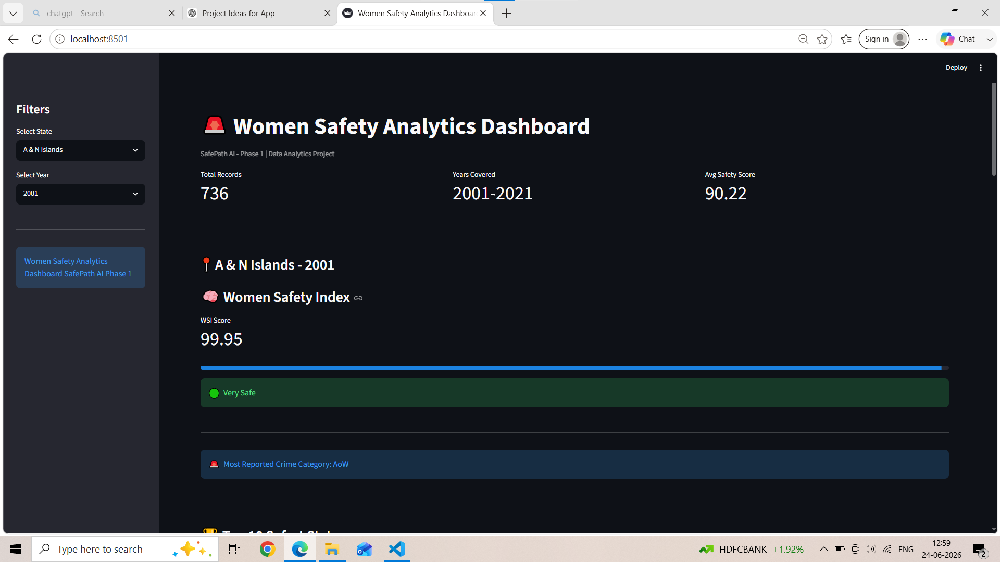
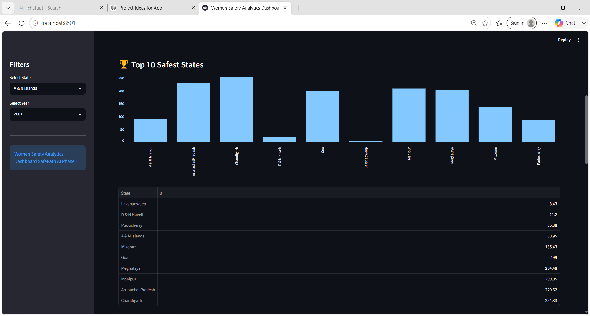
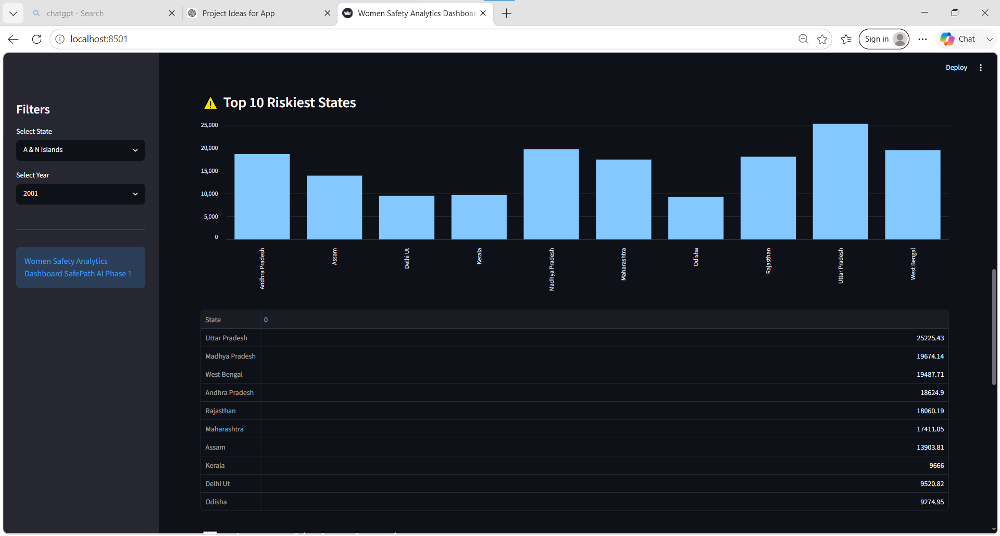
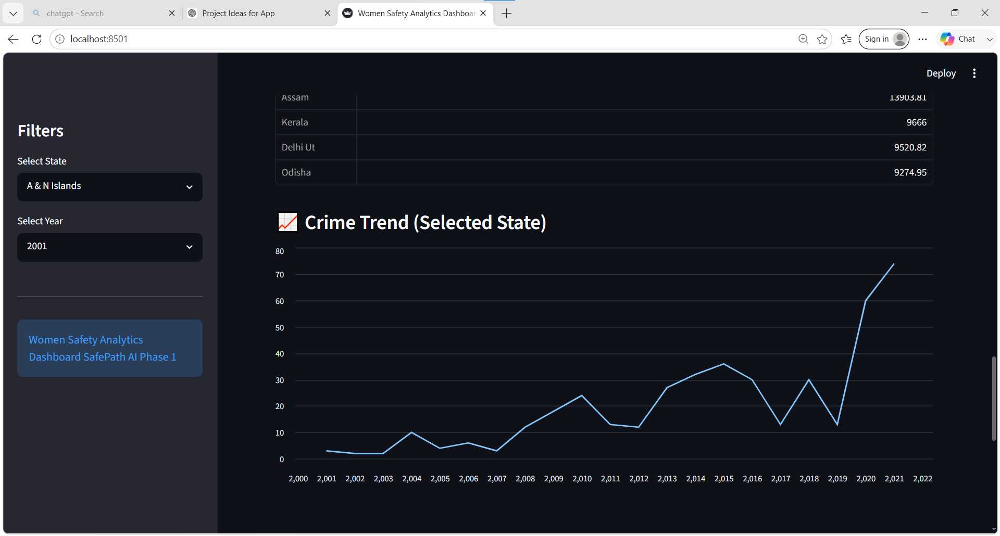
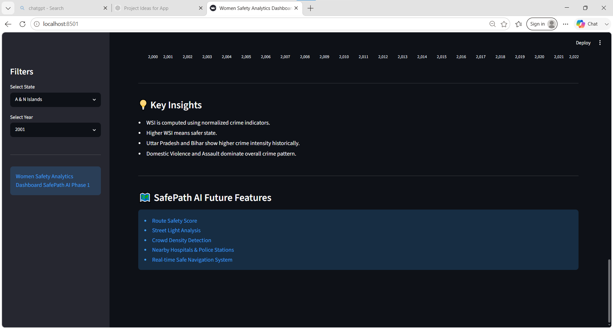

# Women Safety Analytics Dashboard (SafePath AI - Phase 1)

## Overview

This project analyzes crimes against women in India from 2001–2021 and calculates a Women Safety Index (WSI) using weighted crime categories.

## Features

- Women Safety Index (WSI)
- State-wise Analysis
- Year-wise Filtering
- Safe vs Risky States Comparison
- Crime Trend Analysis
- Crime Category Breakdown
- Interactive Dashboard using Streamlit

## Technologies Used

- Python
- Pandas
- Streamlit
- Matplotlib

## Dataset

Crimes Against Women in India (2001–2021)

## Achivement through project
✅ Data Cleaning
✅ Exploratory Data Analysis (EDA)
✅ Women Safety Index (WSI) Creation
✅ Risk Score Calculation
✅ Streamlit Dashboard
✅ State & Year Filters
✅ Crime Trend Analysis
✅ Top Safe / Risky States Analysis
✅ README.md
✅ requirements.txt
✅ GitHub Upload

## Future Scope

- Route Safety Score
- Street Light Analysis
- Nearby Hospitals
- Nearby Police Stations
- Crowd Density Analysis
- Real-Time Safe Route Recommendation

## Dashboard Preview

### Main Dashboard

### Safety Analysis

### risk analysis

### crime trend analysis

### insights 

## Live Demo

🔗 Streamlit App:
https://your-app-link.streamlit.app
